## 0. 创建页面

先找到自己要放在哪个目录的编码

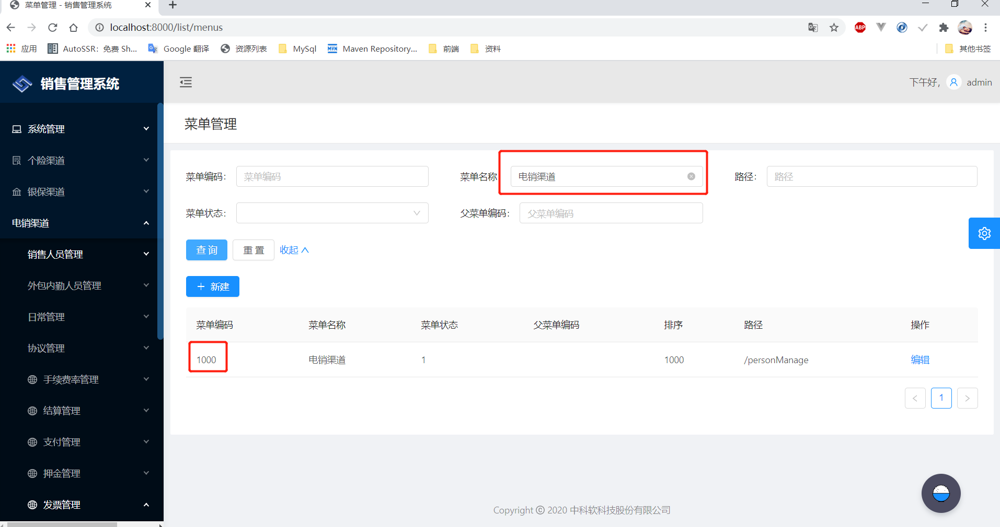

再根据父编码找到里面的模块编码

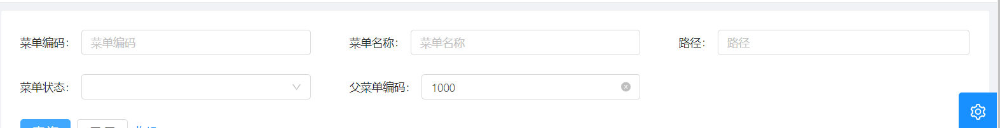


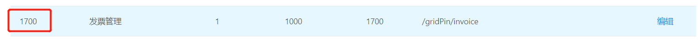

根据父菜单编码查看已经存在的菜单编码，新建一个不存在的编码

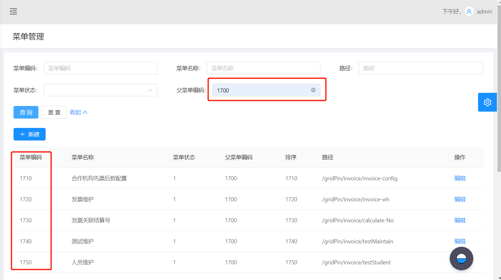

新建菜单

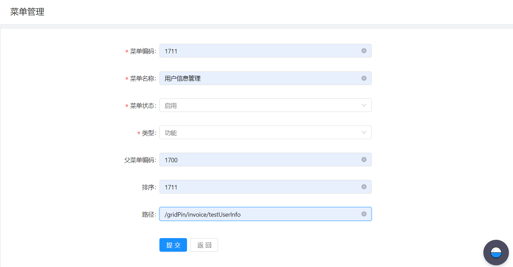

找到登录的角色，点菜单

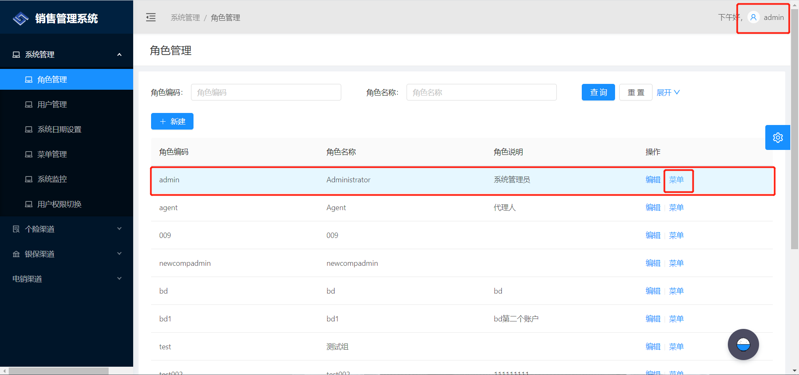

将刚建好的模块勾选

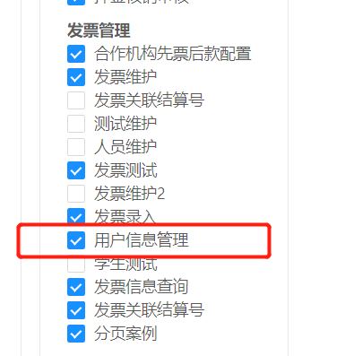


根据路径，在 router.config.js里查找

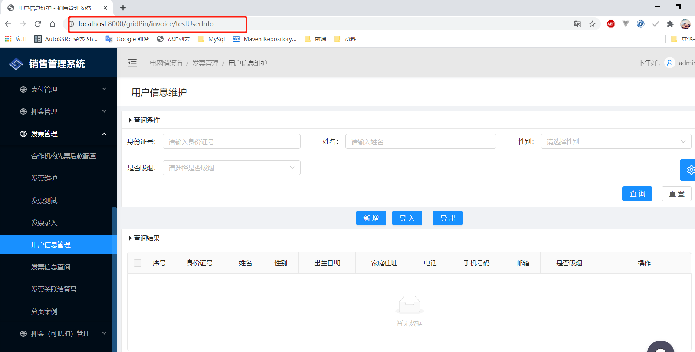


## 1. router.config.js

在config文件夹下找到router.config.js，配置路由

~~~router.config.js
// 用户信息管理
{
path: '/gridPin/invoice/testUserInfo',  // 浏览器URI路径
name: 'testUserInfo', 
icon: 'deposit1',
component: './TestUserInfo/index',  // TestUserInfo：pages里的文件夹名称 index：index.js
},
~~~

## 2. index.js

在pages里找到TestUserInfo文件夹，先看index.js

~~~index.js
render() {
	return <div>{this.getView()}</div>;  // ctrl+左键，查看getView()
}
~~~

```index.js
getView = () => {
    const {
      testUserInfo: { currView },
    } = this.props;
    let result = <Home />;  // 当前视图是home.js
        if (currView === 'edit') { // 如果当前视图是edit，就找edit.js
        	result = <Edit />;
        }
        return result;
};
```


​    ​        

  ## 3.  home.js

home.js,找到getColumns()方法的return[ {},{},{} ]，大括号里写的是查询结果Table表格的列名
例如：

~~~home.js
{
    title: formatMessage({ id: 'testUserInfo.name' }),  // 列名，这里引用的是国际化，会根据zh-CN.js自动转换为中文
    dataIndex: 'name',
    align: config.tableColAlign,
},
~~~

这里的国际化是在当前的TestUserInfo文件夹下的i18n下的zh-CN.js文件里配置的,用姓名举例

~~~zh-CN.js
'testUserInfo.name': '姓名',
~~~

对应的浏览器部分：

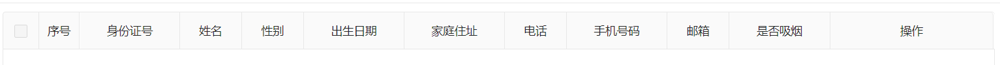

 home.js文件中自己的render()方法，返回的是<PageHeaderWrapper>组件，是整个页面的布局。

~~~home.js
return (
   <PageHeaderWrapper title={<FormattedMessage id="testUserInfo.home.title" />}>
      <Card></Card> //这个Card里面主要写的是查询条件模块
      <div></div> //这个div里面主要写的是需要的按钮
      <Card></Card> //这个Card里面主要写查询结果模块
    </PageHeaderWrapper>
 );    
~~~

在浏览器的样子是：

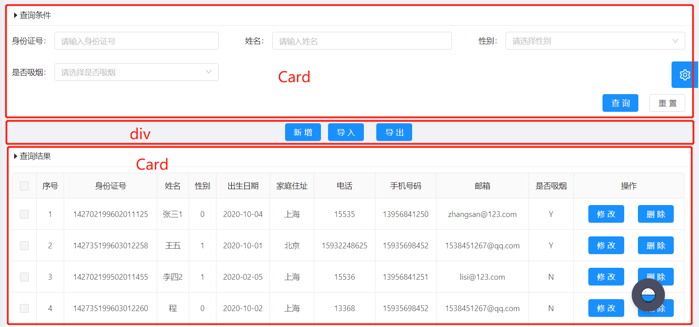

拿第一个Card说明：

~~~home.js
<Card
    bordered={config.cardboard}
    size={config.cardsize}
    title={
    <div>
        <Icon type="caret-right" />
        <FormattedMessage id="global.query.title" /> // 每个页面都有查询条件，所以这里引用的是全局国际化，在src下的locales下的zh-CN文件夹下的global.js里'global.query.title': '查询条件'
    </div>
>
    <div className={styles.tableListForm}>
    	<QueryAdvance cz={this.cz} clearSelect={this.clearSelect} />
    </div>      
</Card>
~~~

##  4.  queryAdvance.js

queryAdvance.js文件，这个文件主要是做查询条件的组件配置，查看里面的render()方法,

~~~queryAdvance.js
<Form layout="inline" onSubmit={this.handleSearch}>
    <Row gutter={{ md: 8, lg: 24, xl: 48 }}>
    	// 每个列对应的是查询条件的组件
       <Col></Col>
       // 按姓名查询Input组件
       <Col md={8} sm={24}>
       		<FormItem label={<FormattedMessage id="testUserInfo.name" />}>
              {getFieldDecorator('name', { initialValue: queryPara.invoType })(
                <Input allowClear />
              )}
            </FormItem>
       </Col>
       // 按性别选择Select组件
       <Col>
       		<FormItem label={<FormattedMessage id="testUserInfo.sex" />}>
            {getFieldDecorator('sex', { initialValue: queryPara.state })(
              <Select
                allowClear
                placeholder={formatMessage({ id: 'placeholder.testUserInfo.sex' })} //这里写的是组件里面的提示文字，也是用的当前文件的国际化
              >
              	// SelectOption组件主要是写下拉的选项，记得定义const SelectOption = Select.Option;
                <SelectOption key='0'>女</SelectOption>
                <SelectOption key='1'>男</SelectOption>
              </Select>
            )}
          </FormItem>
       </Col>
       <Col></Col>
    </Row>
    <div style={{ overflow: 'hidden' }}>
    	<div style={{ textAlign: 'right' }}>
    		// 两个按钮，查询和重置
    		<Button htmlType="submit" type="primary" disabled={loading}>
              	<FormattedMessage id="global.query" />
            </Button>
    		<Button style={{ marginLeft: '20px' }}
              onClick={this.handleFormReset}
              disabled={loading}
            >
              <FormattedMessage id="global.reset" />
            </Button>
    	</div>
    </div>
</Form>
~~~

上面代码对应浏览器的部分：

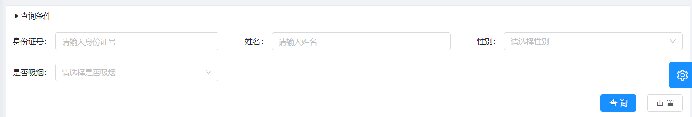

## 5.  edit.js

edit.js里主要写的是新打开的视图，新增修改的页面部分，还是先找到render()方法里的return方法，一个<PageHeaderWrapper>里写全部的组件

~~~edit.js
return (
      <PageHeaderWrapper title={<FormattedMessage id={this.pageTitle(testUserInfo.op)} />}>
        <Card bordered={global.cardboard} size={global.cardsize}>
          <Form onSubmit={this.handleSubmit} style={{ marginTop: 8 }}> //提交表单调用handleSubmit()方法
          	{/* 身份证号 */}
            <FormItem
              {...formItemLayout}
              label={<FormattedMessage id="testUserInfo.cardId" />}
            >
              { getFieldDecorator('cardId', {
                initialValue: currData.cardId,
                rules: [
                  {
                    required: true, //必须输入
                    message: formatMessage({ id: 'validation.testUserInfo.cardId.required' }), //国际化
                  },
                ],
              })(<Input disabled={this.state} allowClear />)}
            </FormItem>
            {/* 性别 */}
            <FormItem
              {...formItemLayout}
              label={<FormattedMessage id="testUserInfo.sex" />}
            >
              {getFieldDecorator('sex', {
                initialValue: currData.sex,
                rules: [
                  {
                    required: true,
                    message: formatMessage({
                    id: 'validation.testUserInfo.sex.required',
                    }),
                  },
                ],
              })(
                <Select
                  disabled={this.state}
                  allowClear
                  placeholder={formatMessage({ id: 'placeholder.testUserInfo.sex' })}
                >
                  <SelectOption key='0'>女</SelectOption>
                  <SelectOption key='1'>男</SelectOption>
                </Select>
                )}
            </FormItem>
			/* 出生日期 */}
            <FormItem {...formItemLayout} label={<FormattedMessage id="testUserInfo.birthday" />}>
              {getFieldDecorator('birthday', {
                initialValue: currData.birthday ? moment(currData.birthday) : null,
                rules: [
                  {
                    required: true,
                    message: formatMessage({
                      id: 'validation.testUserInfo.birthday.required',
                    }),
                  },
                ],
              })(
                <DatePicker
                  disabled = {this.state}
                  style={{ width: '100%' }}
                  placeholder={
                    formatMessage({ id: 'placeholder.testUserInfo.birthday' })
                  }
                />
              )}
            </FormItem>
		 </Form>
       </Card>
    </PageHeaderWrapper>
);   
          
~~~

因为新增和修改用的是同一个页面，所以在提交表单的时候，先判断

~~~edit.js
handleSubmit = e => {
    const { dispatch, form, testUserInfo } = this.props;
    e.preventDefault();
    form.validateFieldsAndScroll((err, values) => {
      const data = values;
      if (!err) {
        let type = 'testUserInfo/add';
        if (testUserInfo.op === 'update') {
          type = 'testUserInfo/update';
          data.id = testUserInfo.currData.id;
        }
        dispatch({
          type,
          payload: data,
        });
      }
    });
  };
~~~

对应浏览器的部分是：

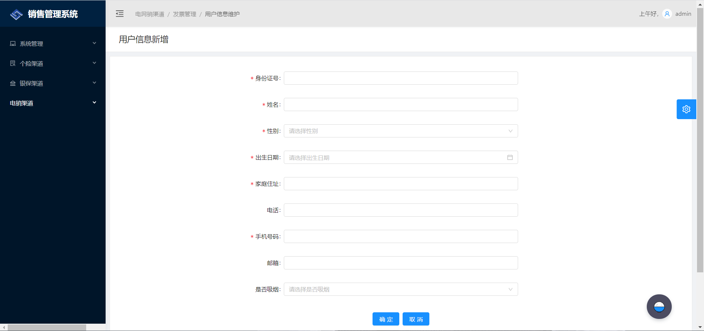


## 6.  model.js

model.js里面主要是写与后端交互的增删改查方法

首先看一下命名空间

~~~
namespace: 'testUserInfo',
~~~

在effects里写方法，其他的js都是通过dispatch里的type对应到这里的方法

## 7. 查询

前端：

~~~
*fetch({ queryPara, callback }, { call, put }) { //queryPara是向后端请求的参数
      const response = yield call(service.pagePost, '/api/test-user-infos/fetch', queryPara);///api/test-user-infos/fetch 与后端对应，service.pagePost：是自己封装的一个api接口，会拼接分页的size，response是响应的结果
      yield put({
        type: 'save',
        payload: response,
        queryPara,
      });
      if (callback) callback(response);
    },
~~~

前端可以通过console.log来调试

```
console.log('queryPara',queryPara)
console.log('response' ,response)
```

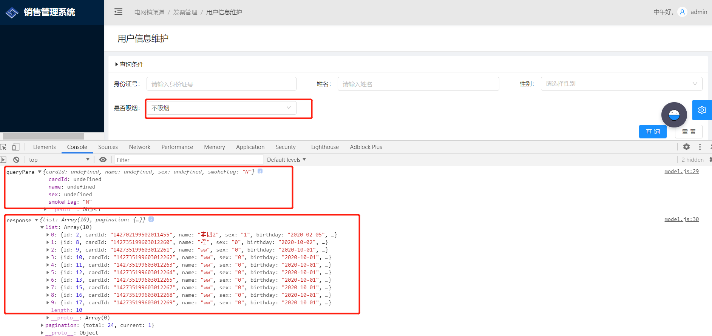

后端的查询部分：

~~~TestUserInfoResource.java
/**
* 查询所有用户信息
* @param testUserInfoDTO
* @param pageable
* @return
*/
    @PostMapping("/test-user-infos/fetch") //与前端对应
    @Timed
    public ResponseEntity<List<TestUserInfoDTO>> getAllTestUserInfos(@RequestBody TestUserInfoDTO testUserInfoDTO, Pageable pageable) {
        log.debug("REST request to get laBankAccNo by criteria: {}", testUserInfoDTO);
        Page<TestUserInfoDTO> page = testUserInfoQueryService.getAllUserInfo(testUserInfoDTO , pageable);
        HttpHeaders headers = PaginationUtil.generatePaginationHttpHeaders(page, "/api/test-user-infos/fetch");
        return ResponseEntity.ok().headers(headers).body(page.getContent());
    }
~~~


~~~
 /**
 * 查询所有用户信息，分页
 *
 * @param testUserInfoDTO
 * @param pageable
 * @return
 */
    public Page<TestUserInfoDTO> getAllUserInfo(TestUserInfoDTO testUserInfoDTO, Pageable pageable) {
        StringBuffer sql = new StringBuffer();
        Map<String, Object> paraMap = new HashMap<>();
        // sql.append("select t.ID,t.CARDID,t.NAME,t.SEX,t.BIRTHDAY,t.HOMEADDRESS,t.PHONE,t.PHONE,t.MOBILE,t.EMAIL,t.SMOKEFLAGE from TestUserInfo t where 1=1 ");
        // 拼sql
        sql.append("select t.* from TestUserInfo t where 1=1 ");
        //身份证号
        if (testUserInfoDTO.getCardId() != null && !"".equals(testUserInfoDTO.getCardId())) {
        	// 用构参的方式，防止sql注入
            paraMap.put("cardId", testUserInfoDTO.getCardId());
            sql.append(" and t.CARDID in (:cardId)");
        }

        //姓名
        if (testUserInfoDTO.getName() != null && !"".equals(testUserInfoDTO.getName())) {
            paraMap.put("name", "%" + testUserInfoDTO.getName() + "%");
            sql.append(" and t.NAME LIKE :name ");
        }

        //性别
        if (testUserInfoDTO.getSex() != null && !"".equals(testUserInfoDTO.getSex())) {
            paraMap.put("sex", testUserInfoDTO.getSex());
            sql.append(" and t.SEX= :sex ");
        }

        //出生日期
        if (testUserInfoDTO.getBirthday() != null && !"".equals(testUserInfoDTO.getBirthday())) {
            paraMap.put("birthday", testUserInfoDTO.getBirthday());
            sql.append(" and t.BIRTHDAY = :birthday ");
        }

        //家庭住址
        if (testUserInfoDTO.getHomeAddress() != null && !"".equals(testUserInfoDTO.getHomeAddress())) {
            paraMap.put("homeaddress", testUserInfoDTO.getHomeAddress());
            sql.append(" and t.HOMEADDRESS = :homeaddress ");
        }

        //电话
        if (testUserInfoDTO.getPhone() != null && !"".equals(testUserInfoDTO.getPhone())) {
            paraMap.put("phone", testUserInfoDTO.getPhone());
            sql.append(" and t.PHONE = :phone ");
        }

        //手机号码
        if (testUserInfoDTO.getMobile() != null && !"".equals(testUserInfoDTO.getMobile())) {
            paraMap.put("mobile", testUserInfoDTO.getMobile());
            sql.append(" and t.MOBILE = :mobile ");
        }

        //邮箱
        if (testUserInfoDTO.getEmail() != null && !"".equals(testUserInfoDTO.getEmail())) {
            paraMap.put("eamil", testUserInfoDTO.getEmail());
            sql.append(" and t.EMAIL = :email ");
        }

        //是否吸烟
        if (testUserInfoDTO.getSmokeFlag() != null && !"".equals(testUserInfoDTO.getSmokeFlag())) {
            paraMap.put("smokeflag", testUserInfoDTO.getSmokeFlag());
            sql.append(" and t.SMOKEFLAG = :smokeflag ");
        }

        //页面分页查询 查询total
        StringBuffer countSql = new StringBuffer();
        countSql.append("select count(1) from  ( ").append(sql).append(") a ");
        Query countQuery = entityManager.createNativeQuery(countSql.toString());

        List<TestUserInfo> list = new ArrayList<>();
        Query query = entityManager.createNativeQuery(sql.toString(), TestUserInfo.class);
        //参数化
        for (Map.Entry<String, Object> entry : paraMap.entrySet()) {
            String key = entry.getKey();
            Object value = entry.getValue();
            query.setParameter(key, value);
            countQuery.setParameter(key, value);
        }
        //查询的总记录数
        Integer total = (Integer) countQuery.getSingleResult();
        if (total > 0) {
            query.setFirstResult(pageable.getPageNumber() * pageable.getPageSize());
            if (pageable.getPageNumber() == (total / 10) && total % 10 != 0) { //判断是否是最后一页 若是则修改size
                query.setMaxResults(total % 10);
            } else {
                query.setMaxResults(pageable.getPageSize());
            }
            list = query.getResultList();
        }

        Page<TestUserInfoDTO> page = new PageImpl<TestUserInfoDTO>(testUserInfoMapper.toDto(list), pageable, total);
        return page;
    }
    
~~~


## 8. 新增和修改：

新增：

~~~model.js
*add({ payload, callback }, { call, put }) {
      const response = yield call(service.post, '/api/test-user-infos/add', payload);
      if (response) {
        yield put({
          type: 'openView',
          view: 'home',
          currData: response,
        });
        message.success('添加成功!');
      }
      if (callback) callback();
    },
~~~

~~~
 /**
 * 新增用户信息
 * @param testUserInfoDTO
 * @return
 * @throws URISyntaxException
 */
    @PostMapping("/test-user-infos/add")
    @Timed
    public ResponseEntity<TestUserInfoDTO> addTestUserInfo(@RequestBody TestUserInfoDTO testUserInfoDTO) throws URISyntaxException {
        log.debug("REST request to save LaBank : {}", testUserInfoDTO);
        if (testUserInfoDTO.getId() != null) {
            throw new BadRequestAlertException("A new laBank cannot already have an ID", ENTITY_NAME, "idexists");
        }
        TestUserInfoDTO result = testUserInfoService.save(testUserInfoDTO);
        return ResponseEntity.created(new URI("/openapi/test-user-infos/add/" + result.getId()))
            .headers(HeaderUtil.createEntityCreationAlert(ENTITY_NAME, result.getId().toString()))
            .body(result);
    }
~~~

修改：

~~~model.js
*update({ payload, callback }, { call, put }) {
      const response = yield call(service.put, '/api/test-user-infos', payload);
      // console.log(response);
      if (response) {
        yield put({
          type: 'openView',
          view: 'home',
          currData: response,
        });
        message.success('修改成功!');
      }
      if (callback) callback();
    },
~~~

~~~
@PutMapping("/test-user-infos")
    @Timed
    public ResponseEntity<TestUserInfoDTO> updateTestUserInfo(@Valid @RequestBody TestUserInfoDTO testUserInfoDTO) throws URISyntaxException {
        log.debug("REST request to update TestUserInfo : {}", testUserInfoDTO);
        if (testUserInfoDTO.getId() == null) {
            throw new BadRequestAlertException("Invalid id", ENTITY_NAME, "idnull");
        }
        TestUserInfoDTO result = testUserInfoService.save(testUserInfoDTO);
        return ResponseEntity.ok()
            .headers(HeaderUtil.createEntityUpdateAlert(ENTITY_NAME, testUserInfoDTO.getId().toString()))
            .body(result);
    }
~~~

可以看到，新增和修改调用的是同一个service方法

~~~
  public TestUserInfoDTO save(TestUserInfoDTO testUserInfoDTO) {
        log.debug("Request to save TestUserInfo : {}", testUserInfoDTO);

        TestUserInfo testUserInfo = testUserInfoMapper.toEntity(testUserInfoDTO);
        testUserInfo.setOperator(SecurityUtils.getCurrentUserLogin().get());
        // 新增和修改都需要设置ModifyDate和ModifyTime，写在最前面
        testUserInfo.setModifyDate(LocalDate.now());
        testUserInfo.setModifyTime(PubFun.getSimpleCurrentTime());
        // 如果id是null，代表是新增
        if( testUserInfo.getId() == null ){
            testUserInfo.setMakeDate(LocalDate.now());
            testUserInfo.setMakeTime(PubFun.getSimpleCurrentTime());
            testUserInfo = testUserInfoRepository.save(testUserInfo);
        }else {
        	// 否则就是修改，在这里有个问题，会发现用默认的save()方法做修改的话，MakeDate和MakeTime会为null，所以要自己写修改方法，MakeDate和MakeTime不改就是之前保存的
            testUserInfoRepository.update(testUserInfo.getHomeAddress() , testUserInfo.getPhone() , testUserInfo.getMobile() , testUserInfo.getEmail(), testUserInfo.getSmokeFlag()  , testUserInfo.getModifyDate() , testUserInfo.getModifyTime() , testUserInfo.getId());
        }
        return testUserInfoMapper.toDto(testUserInfo);
    }
~~~

修改的方法：

~~~
    /**
     * 修改用户信息
     * @param homeAddress
     * @param phone
     * @param mobile
     * @param email
     * @param smokeFlag
     * @param id
     * @return
     */
    @Modifying
    @Query("update TestUserInfo set HOMEADDRESS =?1 , PHONE = ?2 , MOBILE = ?3 , EMAIL = ?4 , SMOKEFLAG = ?5 ,MODIFYDATE = ?6 , MODIFYTIME = ?7 where ID = ?8")
    Integer update(String homeAddress, String phone, String mobile, String email, String smokeFlag,  LocalDate modifyDate , String modifyTime, Long id );
}
~~~

## 9. 删除

前端：

~~~model.js
*delete({ payload, callback }, { call, put }) {
      const response = yield call(service.del, '/api/test-user-infos', payload);
      if (response) {
        yield put({
          type: 'fetch',
          queryPara: {},
        });
      }
      if (callback) callback();
    },
~~~

后端：

~~~
	@DeleteMapping("/test-user-infos/{id}")
    @Timed
    public ResponseEntity<Void> deleteTestUserInfo(@PathVariable Long id) {
        log.debug("REST request to delete TestUserInfo : {}", id);
        testUserInfoService.delete(id);
        return ResponseEntity.ok().headers(HeaderUtil.createEntityDeletionAlert(ENTITY_NAME, id.toString())).build();
    }
~~~

## 10.分页

前端分页：

在home.js里找到Table标签，添加onChange()方法

```model.js
<Table
  rowSelection={{
    selectedRowKeys,
    onChange: this.onSelectChange,
    columnWidth: 45,
    getCheckboxProps: () => ({
      disabled: true,
    }),
  }} // 表格是否可复选
  dataSource={data.list}
  columns={this.getColumns()}
  rowKey={record => record.id}
  onChange={this.queryPage}
  // pagination={data.pagination}
  pagination={{
    current: current1,
    total: data.pagination != null ? data.pagination.total : '', //从后台获取
  }}
  loading={loading}
  size={config.tablesize}
  bordered={config.tableboard}
/>
```

添加onChange的queryPage方法

```
queryPage = pagination => {
  const {
    dispatch,
    testUserInfo: { queryPara },
  } = this.props;
  setTimeout(() => {
    this.setState({
      rowSN: (pagination.current - 1) * 10,
      current1: pagination.current,
    });
  }, 0);
  const rowSN = pagination.current;
  queryPara.page = pagination.current - 1;
  queryPara.size = 10;
  dispatch({
    type: 'testUserInfo/fetch',
    queryPara,
  });
  dispatch({
    type: 'testUserInfo/resetNum', //重置分页序号
    rowSN,
  });
};
```

在render中的state定义current1

~~~
const { selectedRowKeys , current1 } = this.state;
~~~

点击查询时需要重置current1和rowSN

~~~
cz = () => {
    setTimeout(() => {
      this.setState({
        rowSN: 0,
        current1: 1,
      });
    }, 0);
  };
~~~


~~~
<div className={styles.tableListForm}>
   <QueryAdvance cz={this.cz} clearSelect={this.clearSelect} triggerRef={this.bindRef}/>
</div>
~~~

在引入查询模块时传过去，查询时调用cz()方法

~~~queryAdvance.js
handleSearch = e => {
    e.preventDefault();
    const { dispatch, form, clearSelect,cz } = this.props;
    cz();
}
~~~

model.js里调用的就是封装好的pagePost接口，会在路径后拼接size

~~~model.js
 *fetch({ queryPara, callback }, { call, put }) {
      const response = yield call(service.pagePost, '/api/test-user-infos/fetch', queryPara);
      yield put({
        type: 'save',
        payload: response,
        queryPara,
      });
      if (callback) callback(response);
    },
~~~

可以在page里的services下的api.js里查看，里面也封装了一些其他接口

~~~
export async function pagePost(url, values) {
  // console.info(values.page);
  const params2 = {};
  if (values.page) {
    params2.page = values.page;
  }
  if (values.size) {
    params2.size = values.size;
  } else {
    params2.size = 10;
  }
  const str = stringify(params2);
  let newUrl = url;
  if (str) {
    newUrl = `${url}?${str}`;
  }
  return request(newUrl, {
    method: 'POST',
    body: {
      ...values,
      method: 'post',
    },
  });
}
~~~

后端分页：

resource层：

```TestUserInfoResource.java
@PostMapping("/test-user-infos/fetch")
@Timed
public ResponseEntity<List<TestUserInfoDTO>> getAllTestUserInfos(@RequestBody TestUserInfoDTO testUserInfoDTO, Pageable pageable) {
    log.debug("REST request to get laBankAccNo by criteria: {}", testUserInfoDTO);
    Page<TestUserInfoDTO> page = testUserInfoQueryService.getAllUserInfo(testUserInfoDTO , pageable);
    HttpHeaders headers = PaginationUtil.generatePaginationHttpHeaders(page, "/api/test-user-infos/fetch");
    return ResponseEntity.ok().headers(headers).body(page.getContent());
}
```

service层：

~~~
    /**
     * 查询所有用户信息
     *
     * @param testUserInfoDTO
     * @param pageable
     * @return
     */
    public Page<TestUserInfoDTO> getAllUserInfo(TestUserInfoDTO testUserInfoDTO, Pageable pageable) {
        StringBuffer sql = new StringBuffer();
        Map<String, Object> paraMap = new HashMap<>();
        // sql.append("select t.ID,t.CARDID,t.NAME,t.SEX,t.BIRTHDAY,t.HOMEADDRESS,t.PHONE,t.PHONE,t.MOBILE,t.EMAIL,t.SMOKEFLAGE from TestUserInfo t where 1=1 ");
        sql.append("select t.* from TestUserInfo t where 1=1 ");

        //身份证号
        if (testUserInfoDTO.getCardId() != null && !"".equals(testUserInfoDTO.getCardId())) {
            paraMap.put("cardId", testUserInfoDTO.getCardId());
            sql.append(" and t.CARDID in (:cardId)");
        }

        //姓名
        if (testUserInfoDTO.getName() != null && !"".equals(testUserInfoDTO.getName())) {
            paraMap.put("name", "%" + testUserInfoDTO.getName() + "%");
            sql.append(" and t.NAME LIKE :name ");
        }

        //性别
        if (testUserInfoDTO.getSex() != null && !"".equals(testUserInfoDTO.getSex())) {
            paraMap.put("sex", testUserInfoDTO.getSex());
            sql.append(" and t.SEX= :sex ");
        }

        //出生日期
        if (testUserInfoDTO.getBirthday() != null && !"".equals(testUserInfoDTO.getBirthday())) {
            paraMap.put("birthday", testUserInfoDTO.getBirthday());
            sql.append(" and t.BIRTHDAY = :birthday ");
        }

        //家庭住址
        if (testUserInfoDTO.getHomeAddress() != null && !"".equals(testUserInfoDTO.getHomeAddress())) {
            paraMap.put("homeaddress", testUserInfoDTO.getHomeAddress());
            sql.append(" and t.HOMEADDRESS = :homeaddress ");
        }

        //电话
        if (testUserInfoDTO.getPhone() != null && !"".equals(testUserInfoDTO.getPhone())) {
            paraMap.put("phone", testUserInfoDTO.getPhone());
            sql.append(" and t.PHONE = :phone ");
        }

        //手机号码
        if (testUserInfoDTO.getMobile() != null && !"".equals(testUserInfoDTO.getMobile())) {
            paraMap.put("mobile", testUserInfoDTO.getMobile());
            sql.append(" and t.MOBILE = :mobile ");
        }

        //邮箱
        if (testUserInfoDTO.getEmail() != null && !"".equals(testUserInfoDTO.getEmail())) {
            paraMap.put("eamil", testUserInfoDTO.getEmail());
            sql.append(" and t.EMAIL = :email ");
        }

        //是否吸烟
        if (testUserInfoDTO.getSmokeFlag() != null && !"".equals(testUserInfoDTO.getSmokeFlag())) {
            paraMap.put("smokeflag", testUserInfoDTO.getSmokeFlag());
            sql.append(" and t.SMOKEFLAG = :smokeflag ");
        }


        //页面分页查询 查询total
        StringBuffer countSql = new StringBuffer();
        countSql.append("select count(1) from  ( ").append(sql).append(") a ");
        Query countQuery = entityManager.createNativeQuery(countSql.toString());

        List<TestUserInfo> list = new ArrayList<>();
        Query query = entityManager.createNativeQuery(sql.toString(), TestUserInfo.class);
        //参数化
        for (Map.Entry<String, Object> entry : paraMap.entrySet()) {
            String key = entry.getKey();
            Object value = entry.getValue();
            query.setParameter(key, value);
            countQuery.setParameter(key, value);
        }
        //查询的总记录数，返回给前端
        Integer total = (Integer) countQuery.getSingleResult();
        if (total > 0) {
            query.setFirstResult(pageable.getPageNumber() * pageable.getPageSize());
            if (pageable.getPageNumber() == (total / 10) && total % 10 != 0) { //判断是否是最后一页 若是则修改size
                query.setMaxResults(total % 10);
            } else {
                query.setMaxResults(pageable.getPageSize());
            }
            list = query.getResultList();
        }
        Page<TestUserInfoDTO> page = new PageImpl<TestUserInfoDTO>(testUserInfoMapper.toDto(list), pageable, total);
        return page;
    }
~~~

## 11. 导入

导入的目的是用户可以根据导入模板，上传自己写好的excel文件，通过Java解析，将excel文件里的数据添加到数据库里面

像新增修改那样，点击导入按钮的时候，打开一个新视图，这个页面我们可以复制过来别人的

首先在index.js里配置一下复制过来的upload.js

~~~index.js
let result = <Home />;
    if (currView === 'edit') {
      result = <Edit />;
    }else if(currView === 'upload'){
      result = <Uploading /> // 这里写Uploading，是因为upload.js里写的是export default Uploading;
    }
return result;
~~~

在home.js里新增一个导入按钮

~~~home.js
{/* 导入 */}
<Button
  style={{ marginRight: 23 }}
  type="primary"
  disabled={loading}
  onClick={() =>
  	dispatch({ type: 'testUserInfo/openView', view: 'upload'}) //点击按钮，触发点击事件，会打开upload.js
  }
>
  <FormattedMessage id="testUserInfo.home.importConfig" /> //这里自己改国际化
</Button>
~~~

upload.js

~~~upload.js
import React, { PureComponent } from 'react';
import { connect } from 'dva';
import { Form, Card, Button, Icon, Upload,message,Select,notification } from 'antd';
import { FormattedMessage, formatMessage } from 'umi/locale';
import PageHeaderWrapper from '@/components/PageHeaderWrapper';
import styles from '@/assets/styles/common.less';

const FormItem = Form.Item;


@connect(({ testUserInfo, loading, config, codeselect }) => ({
  testUserInfo,
  config,
  codeselect,
  loading: loading.models.testUserInfo,
}))
@Form.create()
class Uploading extends PureComponent {
  state = {
    fileList: [],
  };

  // 导入模板
  modelExport = () => {
    const { dispatch } = this.props;
    dispatch({
      type: 'testUserInfo/modelExport',
      payload: 'export',
    });
  };

  // 上传
  handleUpload = () => {
    const { fileList } = this.state;
    const { dispatch, form } = this.props;
    const type = 'testUserInfo/upload';
    const formData = new FormData();
    if (fileList.length === 0) {
      message.warn(formatMessage({ id: 'mapping.message.warning.file' }));
      return;
    }

    if (fileList.length > 1) {
      message.warn(formatMessage({ id: 'mapping.message.warning.one' }));
      return;
    }
    fileList.forEach(file => {
      formData.append('file', file, encodeURI(file.name));
      // 校验excel格式
      const fileName = file.name;
      const extend = fileName.substring(fileName.lastIndexOf('.'));
      if(!(extend === '.xlsx' || extend === '.xls') ){
        notification.warning({
          message: '提示',
          description: '文件格式错误，请导入EXCEL文件！',
          duration: 3,
        });
      }
      else {
        dispatch({
          type,
          payload: formData,
        });
      }
    });

  };

  render() {
    const {
      testUserInfo: { queryPara },
      form: { getFieldDecorator },
      config,
      codeselect,
      loading,
      dispatch,
    } = this.props;
    const itemLayout = {
      labelCol: {
        xs: { span: 24 },
        sm: { span: 11 },
      },
      wrapperCol: {
        xs: { span: 24 },
        sm: { span: 12 },
        md: { span: 10 },
      },
    };
    const { fileList } = this.state;
    const props = {
      dispatch,
      onRemove: file => {
        this.setState(state => {
          const index = state.fileList.indexOf(file);
          const newFileList = state.fileList.slice();
          newFileList.splice(index, 1);
          return {
            fileList: newFileList,
          };
        });
      },
      beforeUpload: file => {
        this.setState(state => ({
          fileList: [...state.fileList, file],
        }));
        return false;
      },
      fileList,
    };

    return (
      <PageHeaderWrapper title={<FormattedMessage id="testUserInfo.packagepzdr" />}>
        <Form style={{ marginTop: 8 }} className={styles.tableListForm}>
          <Card bordered={config.cardboard} size={config.cardsize} className={styles.card}>
            {/* 导入文件 */}
            <FormItem {...itemLayout} label={<FormattedMessage id="aRisk.dr" />}>
              {getFieldDecorator('uploadFile', {
                rules: [{ required: true, message: '导入文件不能为空!' }],
                initialValue: queryPara.uploadFile,
              })(
                <Upload {...props}>
                  <Button>
                    <Icon type="upload" /> 请选择导入文件
                  </Button>
                </Upload>
              )}
            </FormItem>

            <span>
              备注：点击此处<a disabled={loading} onClick={this.modelExport}>下载导入模板</a>
            </span>
            <div style={{ overflow: 'hidden' }}>
              <div style={{ textAlign: 'center' }}>
                {/* 执行 */}
                <Button type="primary" htmlType="submit" disabled={loading} onClick={this.handleUpload}>
                  <FormattedMessage id="aRisk.zx" />
                </Button>
                {/* 取消 */}
                <Button
                  type="primary"
                  style={{ marginLeft: 8 }}
                  onClick={() => dispatch({ type: 'testUserInfo/openView', view: 'home' })}
                >
                  <FormattedMessage id="global.cancle" />
                </Button>
              </div>
            </div>
          </Card>
        </Form>
      </PageHeaderWrapper>
    );
  }
}

export default Uploading;
~~~

前端页面到这里就配置好了，

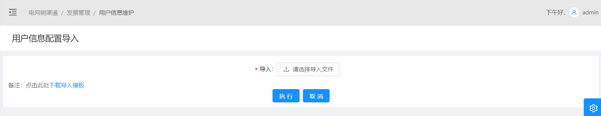

接下来是实现导入模板

在upload.js里，点击下载导入模板连接，会调用modelExport()方法

~~~
 // 导入模板
  modelExport = () => {
    const { dispatch } = this.props;
    dispatch({
      type: 'testUserInfo/modelExport',
      payload: 'export',
    });
  };
~~~

跳到model.js里的modelExport()方法

~~~model.js
// 导入模板下载
    *modelExport({ payload }, { call }) {
      yield call(
        service.port,
        '/api/test-user-infos/PackageConfigImport/modelExport',
        payload,
        'TestUserInfoConfigImport.xlsx' //下载好的文件名
      );
    },
~~~

用到的是api中封装好的port接口

```api.js
export async function port(url, values, filename) {
  return fetch(url, {
    method: 'POST',
    headers: {
      Accept: 'application/json',
      'Content-Type': 'application/json; charset=utf-8',
      Authorization: `Bearer ${localStorage.getItem('token')}`,
    },
    body: JSON.stringify(values),
  }).then(response => {
    if (response.status !== 200 && response.status !== 201) {
      message.error('出错了，请将错误信息excel反馈给管理员');
    }
    response.blob().then(blob => {
      saveAs(blob, filename);
    });
  });
}
```

根据路径，调用后端方法

resource层：

~~~TestUserInfoResource.java
   //下载导入模板
    @PostMapping("/test-user-infos/PackageConfigImport/modelExport")
    @Timed
    public  ResponseEntity<byte[]> newModelExport(@RequestBody String requestMap) throws IOException {
        log.debug("REST request to exportProjects");
        return testUserInfoService.newModelExport();
    }
~~~

service层：

~~~TestUserInfoService.java
 /** 导入模板下载 */
    public ResponseEntity<byte[]> newModelExport()  throws IOException {
        InputStream stream = getClass().getClassLoader().getResourceAsStream("static/tempExcel/TestUserInfoConfigImport.xlsx");
        XSSFWorkbook xssfWorkbook = new XSSFWorkbook(stream);
        // 直接导出模板--不许写入数据
        XSSFSheet sheet = xssfWorkbook.getSheetAt(0);
        ExcelExportUtil edl = new ExcelExportUtil(xssfWorkbook,sheet);
        return edl.outputExcelName(xssfWorkbook, "TestUserInfoConfigImport.xlsx" );
    }
~~~

记得将自己写好的导入模板放在static/tempExcel这里

点击执行的时候，会调用handleUpload()方法,会进行excel格式校验，再转发到model.js

```upload.js
// 上传
handleUpload = () => {
  const { fileList } = this.state;
  const { dispatch, form } = this.props;
  const type = 'testUserInfo/upload';
  const formData = new FormData();
  if (fileList.length === 0) {
    message.warn(formatMessage({ id: 'mapping.message.warning.file' }));
    return;
  }
  if (fileList.length > 1) {
    message.warn(formatMessage({ id: 'mapping.message.warning.one' }));
    return;
  }
  fileList.forEach(file => {
    formData.append('file', file, encodeURI(file.name));
    // 校验excel格式
    const fileName = file.name;
    const extend = fileName.substring(fileName.lastIndexOf('.'));
    if(!(extend === '.xlsx' || extend === '.xls') ){
      notification.warning({
        message: '提示',
        description: '文件格式错误，请导入EXCEL文件！',
        duration: 3,
      });
    }
    else {
      dispatch({
        type,
        payload: formData,
      });
    }
  });

};
```

在model.js里实现upload()方法

```model.js
// 上传导入文件
*upload({ payload,  callback }, { call, put }) {
  const response = yield call(
    service.upload,
    `/api/test-user-infos/PackageConfigImport`,
    payload
  );
  // 系统异常提示
  if (response.code === '-1') {
    notification.error({
      message: '系统异常,请联系运维人员!',
      description: response.message,
      duration: 3, // 三秒自动关闭，可以自定义，不加默认4.5
    });
  }
  if (response.code === '1') {
    notification.warning({
      message: '提示：',
      description: response.message,
      duration: 3,
    });
  }
  if (response.code === '0') {
    notification.success({
      message: '提示：',
      description: response.message,
      duration: 3,
    });
  }
  yield put({
    type: 'uploadFile',
    currData: response,
  });
  if (callback) callback();
},
```

进入后端，

resource层：

```TestUserInfoResource.java
/** 上传导入文件 */
@PostMapping("/test-user-infos/PackageConfigImport")
@Timed
public ResponseEntity<NError> packageConfigImport(@RequestParam("file") MultipartFile file) throws URISyntaxException {
    log.debug("Request to save PackageConfig");
    NError nError = testUserInfoService.packageConfigImport(file);
    return ResponseEntity.created(new URI("/api/test-user-infos/PackageConfigImport"))
        .headers(HeaderUtil.createEntityCreationAlert(ENTITY_NAME,""))
        .body(nError);
}
```

service层：

```TestUserInfoService.java
/**
 * 上传导入文件
 * @param file
 * @return
 */
public NError packageConfigImport(MultipartFile file) {
    log.debug("Request to save PackageConfig");
    NError nError = new NError();
    InputStream is = null;
    Workbook wb = null;

    try{
        TestUserInfoDTO laFile = UpLoadUtilTest.uploadFile(file,"static/fileupload/","");
        File tempFile = new File(laFile.getFilePath());
        //根据新建的文件实例化输入流
        is = new FileInputStream(tempFile);
        //根据文件名判断文件是2003版本还是2007版本
        if(ExcelImportUtil.isExcel2007(laFile.getFileName())){
            wb = new XSSFWorkbook(is);
        }else{
            wb = new HSSFWorkbook(is);
        }
        nError= importData(wb);//校验excel文件
        //删除上传的临时文件
        if(tempFile.exists()){
            tempFile.delete();
        }
    }catch(Exception e){
        e.getStackTrace();
        nError.setCode("-1");
        nError.setClassName("Class: TestUserInfoService");
        nError.setFunctionName("Function: TestUserInfoConfigImport");
        nError.setErrorMessage("Exception: "+e.getClass().getName());
        nError.addErrorInfoMessage();
        return nError;
    } finally {
        if (is != null) {
            try {
                is.close();
            } catch (IOException e) {
                e.printStackTrace();
            }
        }
    }
    return nError;
}
```

```TestUserInfoService.java
    /**
     * 校验保存excel数据
     * @param wb
     * @return
     */
    public NError importData(Workbook wb){
        NError nError = new NError();
        String operator = SecurityUtils.getCurrentUserLogin().get();
        LocalDate currentDate = PubFun.getCurrentLocalDate();
        String currentTime = PubFun.getSimpleCurrentTime();
        // 得到第一个sheet
        Sheet sheet1 = wb.getSheetAt(0);
        try {
            //校验表单数据--上传excle中的sheet名字必须跟模板一样
            String sheetName1 = sheet1.getSheetName();
            if (!"用户信息导入模板".equals(sheetName1)) {
                nError.setCode("1");
                nError.setMessage("请使用页面下载的模板上传数据！");
                return nError;
            }

        }catch (Exception e) {
            nError.setCode("1");
            nError.setMessage("解析Excel失败，是否文件类型不正确？");
            return nError;
        }

        try{
            //获取第一个sheet页
            //数据为空，模板行有4行
            if (sheet1.getLastRowNum() < 5) {
                nError.setCode("1");
                nError.setMessage("至少添加一条记录，请调整重试！");
                return nError;
            }

            int sheet1LastRowNum = sheet1.getLastRowNum(); // 看看sheet1有多少行
			// System.out.println(sheet1LastRowNum);
            for(int i=4;i<=sheet1LastRowNum;i++){
                int num = i+1;
                Row row = sheet1.getRow(i);
                if (row == null) {
                    nError.setCode("1");
                    nError.setMessage("表格中存在空白行，请调整重试！");
                    return nError;
                }
                Cell cell1 = row.getCell(1);
                cell1.setCellType(CellType.STRING);
                if(cell1 == null || "".equals(cell1.getStringCellValue().trim())){
                    nError.setCode("1");
                    nError.setMessage("解析数据失败，第"+num+"行身份证号不能为空！");
                    return nError;
                }
                //将excel数据与数据库对比不能重复，在用户输入身份证的时候可以用excel自带的数据校验重复项来实现
                String cardId = cell1.getStringCellValue();
				//select * from TestUserInfo where CARDID = '142735199603012259'
                String csql = "select count(*) from TestUserInfo where CARDID =?1 ";
                Query cquery = entityManager.createNativeQuery(csql);
                cquery.setParameter(1,cardId);
                Integer resultList = (Integer) cquery.getSingleResult();
				//System.out.println(resultList);
                if (resultList>0){
                    nError.setCode("1");
                    nError.setMessage("解析数据失败，第"+num+"行身份证号已存在！");
                    return nError;
                }

            }

            // 校验后进行数据处理
            for (int i=4;i<=sheet1LastRowNum;i++) {
            	// 先获取每一行
                Row row = sheet1.getRow(i);
                // 再获取当前行的每个单元格
                //身份证号
                Cell cell1 = row.getCell(1);
                String cardId = getStringCellValue(cell1); //这里自己写的一个方法，用来获取单元格的内容
                //姓名
                Cell cell2 = row.getCell(2);
                String name = getStringCellValue(cell2);
                //性别
                Cell cell3 = row.getCell(3);
                String sex = getStringCellValue(cell3);
                sex = "女".equals(sex)?"0":"1"; 
                //出生日期
                Cell cell4 = row.getCell(4);
                String birthday = getStringCellValue(cell4);
                //家庭住址
                Cell cell5 = row.getCell(5);
                String homeAddress = getStringCellValue(cell5);
                //电话
                Cell cell6 = row.getCell(6);
                String phone = getStringCellValue(cell6);
                //手机号码
                Cell cell7 = row.getCell(7);
                String mobile = getStringCellValue(cell7);
                //邮箱
                Cell cell8 = row.getCell(8);
                String email = getStringCellValue(cell8);
                //是否吸烟
                Cell cell9 = row.getCell(9);
                String smokeFlag = getStringCellValue(cell9);
                smokeFlag = "是".equals(smokeFlag)?"Y":"N";
				//将数据插入数据库中
                String csql = "insert into TestUserInfo(CARDID,NAME,SEX,BIRTHDAY,HOMEADDRESS,PHONE,MOBILE,EMAIL,SMOKEFLAG,OPERATOR,MAKEDATE,MAKETIME)  values (?1,?2,?3,?4,?5,?6,?7,?8,?9,?10,?11,?12)";
                Query cquery = entityManager.createNativeQuery(csql);
                cquery.setParameter(1,cardId).setParameter(2,name).setParameter(3,sex)
                    .setParameter(4,birthday).setParameter(5,homeAddress).setParameter(6,phone)
                    .setParameter(7,mobile).setParameter(8,email)
                    .setParameter(9,smokeFlag).setParameter(10,operator).setParameter(11,currentDate)
                    .setParameter(12,currentTime);
                cquery.executeUpdate();
            }

        }
        catch(Exception e){
            e.printStackTrace();
            nError.setCode("-1");
            nError.setClassName("Class: TestUserInfoService");
            nError.setFunctionName("Function: importData");
            nError.setErrorMessage("Exception: "+e.getClass().getName());
            nError.addErrorInfoMessage();
            return nError;
        }
        nError.setCode("0");
        nError.setMessage("导入成功");
        return nError;
    }
```


```TestUserInfoService.java
// 获取单元格的内容
private static String getStringCellValue(Cell cell){
    if (cell==null){
        return null;
    }else {
        cell.setCellType(CellType.STRING); //将单元格的类型转化为String类型
        return cell.getStringCellValue().trim();
    }
}
```

## 12. 导出

首先在home.js里添加导出按钮

~~~home.js
{/* 导出 */}
<Button type="primary" onClick={this.export} loading={loading}>
   <FormattedMessage id="aRisk.dc" />
</Button>
~~~

这里用到了父子组件，因为是根据查询条件来导出相关的内容

```home.js
// 从this.child取出方法
export = () => {
  this.child.printExcel();
};
```

在queryAdvance.js里写导出方法

```queryAdvance.js
// 打印报表
printExcel = () => {
  const { form, dispatch } = this.props;
  form.validateFields((err, fieldsValue) => {
    if (err) return;
    // 导出
    // 报表名称
    const fileName = `TestUserInfoPrint.xlsx`;
    // console.log('export',fieldsValue);
    dispatch({
      type: 'testUserInfo/export',
      queryPara: fieldsValue,
      exportName: fileName,
    });
  });
};
```

父子组件传递属性

```queryAdvance.js
const { dispatch,triggerRef } = this.props;
triggerRef(this); // 把子组件中的方法，属性带到父组件
```

```home.js
// 把子组件中的方法属性放入this.child中
bindRef = ref => { this.child = ref };
<QueryAdvance cz={this.cz} clearSelect={this.clearSelect} triggerRef={this.bindRef}/>
```

在model.js里写export方法

```model.js
// 导出
*export({ queryPara,exportName}, { call }) {
  yield call(service.port, '/api/test-user-infos/testUserInfoExport', queryPara, exportName);
},
```

跳转到后端：

resource层：

```TestUserInfoResource.java
/**
 * 导出
 * @param queryPara
 * @return
 * @throws IOException
 */
@PostMapping("/test-user-infos/testUserInfoExport")
@Timed
public ResponseEntity<byte[]> testUserInfoExport(@RequestBody TestUserInfoQueryParaModel queryPara) throws IOException {
    log.debug("export agentInfoList by queryPara : {}",queryPara );
    return testUserInfoService.testUserInfoExport(queryPara);
}
```

service层：

```TestUserInfoService.java
    /**
     * 用户信息导出
     * @param queryPara
     * @return
     */
    public ResponseEntity<byte[]> testUserInfoExport(TestUserInfoQueryParaModel queryPara) throws IOException {

        //查询要导出的明细信息
        List<TestUserInfo> modelList = testUserInfoQueryService.testUserInfoExportQuery(queryPara);

        // 0、设置导入模板
        // 1.1、找到模板的位置
        InputStream stream = getClass().getClassLoader().getResourceAsStream("static/tempExcel/TestUserInfoConfigImport.xlsx");
        // 1.2、读取excel模板
        XSSFWorkbook xssfWorkbook = new XSSFWorkbook(stream);
        SXSSFWorkbook wb = new SXSSFWorkbook(xssfWorkbook,100);
        // 1.3、读取了模板内所有sheet内容。(这里只读取第1个sheet页）
        //Sheet sheet = wb.getSheetAt(0);
        XSSFSheet sheet = xssfWorkbook.getSheetAt(0);
        // 1.4、将wb sheet 初始化到ExcelExportUtil文件中去
        ExcelExportUtil1 edl = new ExcelExportUtil1(wb,sheet);

        // 1.5 设置一下打印样式
        // （1）字体
        XSSFFont font = xssfWorkbook.createFont();
        font.setFontName("宋体");
        font.setFontHeightInPoints((short)10);
        CellStyle cellStyle = wb.createCellStyle();
        cellStyle.setFont(font);
        // (2) 边框
        cellStyle.setBorderBottom(BorderStyle.THIN); //下边框
        cellStyle.setBorderLeft(BorderStyle.THIN);//左边框
        cellStyle.setBorderTop(BorderStyle.THIN);//上边框
        cellStyle.setBorderRight(BorderStyle.THIN);//右边框
        //（3）对齐方式
        cellStyle.setAlignment(HorizontalAlignment.CENTER);
        cellStyle.setVerticalAlignment(VerticalAlignment.CENTER);
        //-------------------------------------业务区域开始------------------------------------------
        // 2、处理业务逻辑(将数据添加进excel表中)
        XSSFRow row = null;
        for (int i = 0; i < modelList.size(); i++) {
            // 2.1、创建list.size()行数据
            row = sheet.createRow(i + 4); // 在第五行开始写
            // 2.2、把值一一写进单元格里
            TestUserInfo model = modelList.get(i);
            int j = 1;  // j 为列号
            // 目前样式没有什么好方法去设置，目前只通过单个设置单元格处理
            XSSFCell cell01 = row.createCell(j);
            cell01.setCellStyle(cellStyle);
            cell01.setCellValue(model.getCardId() != null ? model.getCardId() : "");  // 身份证号
            XSSFCell cell02 = row.createCell(++j);
            cell02.setCellStyle(cellStyle);
            cell02.setCellValue(model.getName()!=null?model.getName():""); // 姓名
            XSSFCell cell03 = row.createCell(++j);
            cell03.setCellStyle(cellStyle);
            cell03.setCellValue(model.getSex()!=null&&("0".equals(model.getSex()))?"女":"男"); // 性别
            XSSFCell cell04 = row.createCell(++j);
            cell04.setCellStyle(cellStyle);
            cell04.setCellValue(model.getBirthday().toString()!=null?model.getBirthday().toString():""); // 出生日期
            XSSFCell cell05 = row.createCell(++j);
            cell05.setCellStyle(cellStyle);
            cell05.setCellValue(model.getHomeAddress()!=null?model.getHomeAddress():""); // 家庭住址
            XSSFCell cell07 = row.createCell(++j);
            cell07.setCellStyle(cellStyle);
            cell07.setCellValue(model.getPhone()!=null?model.getPhone():""); // 电话
            XSSFCell cell08 = row.createCell(++j);
            cell08.setCellStyle(cellStyle);
            cell08.setCellValue(model.getMobile()!=null?model.getMobile():""); // 手机号码
            XSSFCell cell09 = row.createCell(++j);
            cell09.setCellStyle(cellStyle);
            cell09.setCellValue(model.getEmail()!=null?model.getEmail():""); // 邮箱
            XSSFCell cell10 = row.createCell(++j);
            cell10.setCellStyle(cellStyle);
            cell10.setCellValue(model.getSmokeFlag()!=null&&("Y".equals(model.getSmokeFlag()))?"是":"否"); // 是否吸烟
        }

        String currdate = PubFun.getSimpleCurrentDate();
        // 制表时间
        XSSFCell currdateCell = sheet.getRow(2).getCell(6);
        currdateCell.setCellValue(currdate);


        //-------------------------------------业务区域结束------------------------------------------
        //**********************************公共信息******************************************************
        return edl.outputExcelName(wb, "TestUserInfoPrint.xlsx");

    }
```

## 13. 下拉填充

先看效果，以发票维护为例:

可以在浏览器上查看到请求路径：

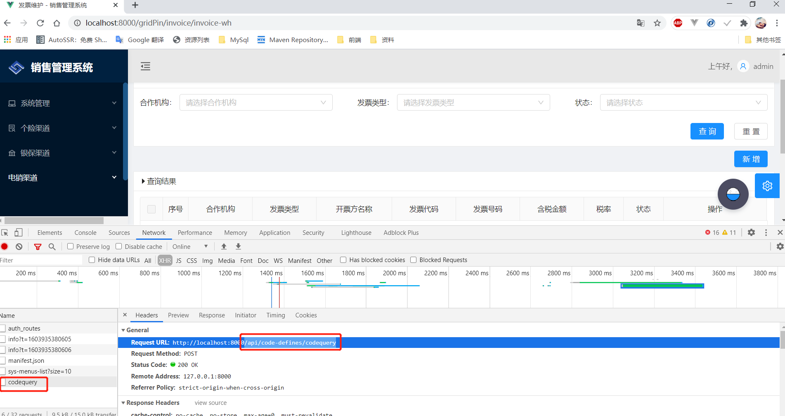

点进去看response，可以看到响应的数据：

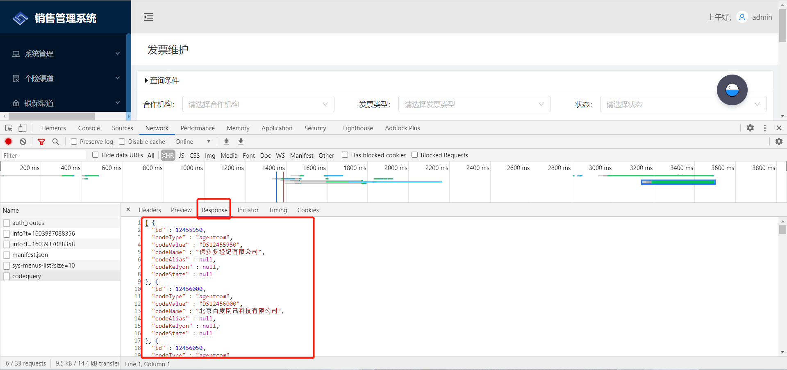

要做的效果：

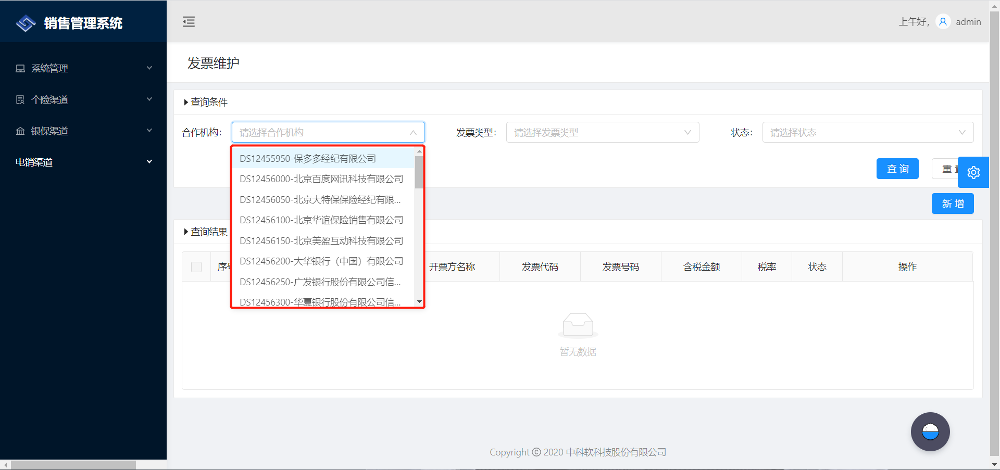

前端：

打开发票维护页面的时候，queryAdvance.js会初始化数据

~~~queryAdvance.js
componentDidMount() {
    const { dispatch } = this.props;
    // 初始化合作机构清单
    dispatch({
      type: 'codeselect/codequery',
      queryPara: {
        codeType: 'agentcom',
      },
    });
    dispatch({
      type: 'invoiceMaintenance/resetTable',
      queryPara: {},
    });
  }
~~~

在models文件夹下的codeselect.js可以找到codeQuery方法

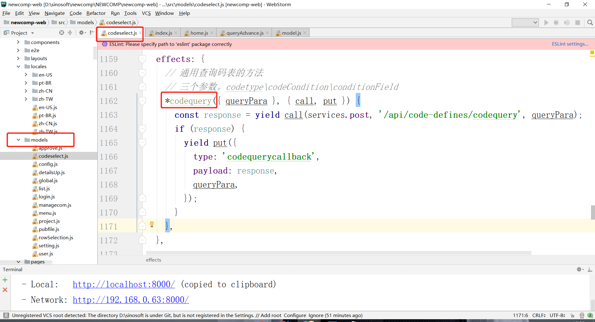

在renders方法里实现了codequerycallback()方法：

~~~
codequerycallback(state, action) {
      switch (action.queryPara.codeType) {
        case 'agentcom':
          return { ...state, agentComData: action.payload || state.agentComData };
        case 'managCom':
          return { ...state, manageComData: action.payload || state.manageComData };
        case 'agentcomYN':
          return { ...state, agentComYNData: action.payload || state.agentComYNData };
        case 'managecom':
          return { ...state, orgSelectData: action.payload || state.orgSelectData };
        case 'approveState':
          return { ...state, approveStateData: action.payload || state.approveStateData };
        case 'feetype':
          return { ...state, feeType: action.payload || state.feeType };
        case 'tcompact':
          return { ...state, tCompatCodeData: action.payload || state.tCompatCodeData };
        case 'compact':
          return { ...state, compatCodeData: action.payload || state.compatCodeData };
        case 'maincompact':
          return { ...state, mCompatCodeData: action.payload || state.mCompatCodeData };
        case 'bankcode':
          return { ...state, bankCodeData: action.payload || state.bankCodeData };
        case 'projectcode':
          return { ...state, projectCodeData: action.payload || state.projectCodeData };
        case 'riskcode':
          return { ...state, riskCode: action.payload || state.riskCode };
        case 'pkgriskcode':
          return { ...state, productPlan: action.payload || state.productPlan };
        case 'rprojectcode':
          return { ...state, rProjectCodeData: action.payload || state.rProjectCodeData };
        case 'payIntv':
          return { ...state, payIntv: action.payload || state.payIntv };
        case 'payYearsType':
          return { ...state, payYearsType: action.payload || state.payYearsType };
        case 'dateType':
          return { ...state, dateType: action.payload || state.dateType };
        case 'countType':
          return { ...state, countType: action.payload || state.countType };
        case 'paynumber':
          return { ...state, payNo: action.payload || state.payNo };
        case 'rvProjectcode':
          return { ...state, rvProjectcode: action.payload || state.rvProjectcode };
        case 'approveModifyState':
          return {
            ...state,
            approveModifyStateData: action.payload || state.approveModifyStateData,
          };
        case 'scenceList':
          return { ...state, scenceList: action.payload || state.scenceList };
        case 'licenseeList':
          return { ...state, licenseeList: action.payload || state.licenseeList };
        case 'lposition':
          return { ...state, lposition: action.payload || state.lposition };
        case 'lposition2':
          return { ...state, lposition2: action.payload || state.lposition2 };
        case 'lposition3':
          return { ...state, lposition3: action.payload || state.lposition3 };
        case 'lrank':
          return { ...state, lrank: action.payload || state.lrank };
        case 'position2':
          return { ...state, position: action.payload || state.position };
        case 'branch':
          return { ...state, branch: action.payload || state.branch };
        case 'user':
          return { ...state, user: action.payload || state.user };
        case 'callCenter':
          return { ...state, callCenter: action.payload || state.callCenter };
        case 'organization':
          return { ...state, organizationList: action.payload || state.organizationList };
        case 'wcallcenter':
          return { ...state, wcallcenterList: action.payload || state.wcallcenterList };
        case 'section':
          return { ...state, sectionList: action.payload || state.sectionList };
        case 'unit':
          return { ...state, unitList: action.payload || state.unitList };
        case 'team':
          return { ...state, teamList: action.payload || state.teamList };

        case 'zOrganization':
          return { ...state, zOrganization: action.payload || state.zOrganization };
        case 'zBranchCity':
          return { ...state, zBranchCity: action.payload || state.zBranchCity };
        case 'zSourceType':
          return { ...state, zSourceType: action.payload || state.zSourceType };
        case 'zSource':
          return { ...state, zSource: action.payload || state.zSource };
        case 'zRecruitmentPosition':
          return { ...state, zRecruitmentPosition: action.payload || state.zRecruitmentPosition };
        case 'zRecruitmentRank':
          return { ...state, zRecruitmentRank: action.payload || state.zRecruitmentRank };
        case 'jobLevel':
          return { ...state, jobLevel: action.payload || state.jobLevel };
        case 'job':
          return { ...state, job: action.payload || state.job };
        case 'showJobLevel':
          return { ...state, showJobLevel: action.payload || state.showJobLevel };
        case 'code':
          return { ...state, code: action.payload || state.code };
        case 'showOrgName':
          return { ...state, showOrgName: action.payload || state.showOrgName };
        case 'allJobLevel':
          return { ...state, allJobLevel: action.payload || state.allJobLevel };
        case 'zNativePlace':
          return { ...state, zNativePlace: action.payload || state.zNativePlace };
        case 'zNationality':
          return { ...state, zNationality: action.payload || state.zNationality };
        case 'zPosition':
          return { ...state, zPosition: action.payload || state.zPosition };
        case 'zRank':
          return { ...state, zRank: action.payload || state.zRank };
        case 'zRank2':
          return { ...state, zRank2: action.payload || state.zRank2 };

        case 'hOrg':
          return { ...state, hOrg: action.payload || state.hOrg };

        case 'zProvince':
          return { ...state, zProvince: action.payload || state.zProvince };
        case 'zHouseholdRegister':
          return { ...state, zHouseholdRegister: action.payload || state.zHouseholdRegister };
        case 'position':
          return { ...state, positionList: action.payload || state.positionList };
        case 'wrank':
          return { ...state, wrankList: action.payload || state.wrankList };
        case 'hBranchLevel':
          return { ...state, hBranchLevel: action.payload || state.hBranchLevel };
        case 'lpcode':
          return { ...state, lpcode: action.payload || state.lpcode };
        case 'lptitle':
          return { ...state, lptitle: action.payload || state.lptitle };
        case 'rankcode':
          return { ...state, rankcode: action.payload || state.rankcode };
        case 'branchlevel':
          return { ...state, branchlevel: action.payload || state.branchlevel };
        case 'agentgrade':
          return { ...state, agentgradeList: action.payload || state.agentgradeList };
        case 'hBranchType':
          return { ...state, hBranchType: action.payload || state.hBranchType };
        case 'hAdjustType':
          return { ...state, hAdjustType: action.payload || state.hAdjustType };
        case 'hStatFlag':
          return { ...state, hStatFlag: action.payload || state.hStatFlag };
        case 'hStatus':
          return { ...state, hStatus: action.payload || state.hStatus };
        case 'pauseType':
          return { ...state, pauseTypeList: action.payload || state.pauseTypeList };
        case 'agentgradenew3':
          return { ...state, agentgradenewList: action.payload || state.agentgradenewList };
        case 'departRsn':
          return { ...state, departRsnList: action.payload || state.departRsnList };
        case 'salaryItem':
          return { ...state, salaryItem: action.payload || state.salaryItem };
        case 'subjectCode':
          return { ...state, subjectCode: action.payload || state.subjectCode };
        case 'businessType1':
          return { ...state, businessType1: action.payload || state.businessType1 };
        case 'peopleTypeInfo':
          return { ...state, peopleTypeInfo: action.payload || state.peopleTypeInfo };
        case 'gradeSeries':
          return { ...state, gradeSeries: action.payload || state.gradeSeries };
        case 'polAuditState':
          return { ...state, polAuditState: action.payload || state.polAuditState };
        case 'checkFlag':
          return { ...state, checkFlag: action.payload || state.checkFlag };
        case 'subjectCodeRelation':
          return { ...state, subjectCodeRelation: action.payload || state.subjectCodeRelation };
        case 'hAgentGrade':
          return { ...state, hAgentGrade: action.payload || state.hAgentGrade };
        case 'polstate2':
          return { ...state, polState2List: action.payload || state.polState2List };
        case 'agentgradenew':
          return { ...state, agentgradenewList2: action.payload || state.agentgradenewList2 };
        case 'AgentTitle':
          return { ...state, AgentTitleList2: action.payload || state.AgentTitleList2 };
        case 'addpeonew':
          return { ...state, addpeonewList2: action.payload || state.addpeonewList2 };
        case 'integrationflag':
          return { ...state, integrationflagList2: action.payload || state.integrationflagList2 };
        case 'agenttype':
          return { ...state, agenttypeList2: action.payload || state.agenttypeList2 };
        case 'hOfferType':
          return { ...state, hOfferType: action.payload || state.hOfferType };
        case 'PreAnnualBonusRate':
          return { ...state, PreAnnualBonusRate: action.payload || state.PreAnnualBonusRate };
        case 'agxcomtype':
          return { ...state, agxcomtype: action.payload || state.agxcomtype };
        case 'MultiselectManageCom':
          return { ...state, MultiselectManageCom: action.payload || state.MultiselectManageCom };
        case 'entryNo':
          return { ...state, entryNo: action.payload || state.entryNo };
        case 'dayReportType':
          return { ...state, dayReportType: action.payload || state.dayReportType };
        case 'staffType':
          return { ...state, staffTypeList: action.payload || state.staffTypeList };
        case 'district':
          return { ...state, districtList: action.payload || state.districtList };
        case 'monthCount':
          return { ...state, monthCount: action.payload || state.monthCount };
        case 'packageoptype':
          return { ...state, packageOpType: action.payload || state.packageOpType };
        case 'laday_reporttype':
          return { ...state, laDayReportType: action.payload || state.laDayReportType };
        case 'hReportType':
          return { ...state, hReportType: action.payload || state.hReportType };
        case 'branchLevel':
          return { ...state, branchLevel: action.payload || state.branchLevel };
        case 'SubRiskCode':
          return { ...state, SubRiskCode: action.payload || state.SubRiskCode };
        case 'agentGradeNew':
          return { ...state, agentGradeNew: action.payload || state.agentGradeNew };
        case 'assessState':
          return { ...state, assessState: action.payload || state.assessState };
        case 'yesOrNo1':
          return { ...state, yesOrNo1: action.payload || state.yesOrNo1 };
        case 'zBranchCity2':
          return { ...state, zBranchCity2: action.payload || state.zBranchCity2 };
        case 'lorganization':
          return { ...state, lorganization: action.payload || state.lorganization };
        case 'localmonth':
          return { ...state, localmonth: action.payload || state.localmonth };
        case 'manageCom2':
          return { ...state, manageCom2: action.payload || state.manageCom2 };
        case 'branchComCode':
          return { ...state, branchComCode: action.payload || state.branchComCode };
        case 'bankasspritype':
          return { ...state, bankasspritype: action.payload || state.bankasspritype };
        // bankagency
        case 'bankagency':
          return { ...state, bankagency: action.payload || state.bankagency };
        // indirectKind
        case 'indirectKind':
          return { ...state, indirectKind: action.payload || state.indirectKind };
        case 'indirectKind3':
          return { ...state, indirectKind3: action.payload || state.indirectKind3 };
        case 'grpNature':
          return { ...state, grpNature: action.payload || state.grpNature };
        case 'channelType':
          return { ...state, channelType: action.payload || state.channelType };
        case 'areaType':
          return { ...state, areaType: action.payload || state.areaType };
        case 'bankType':
          return { ...state, bankType: action.payload || state.bankType };
        case 'businessType':
          return { ...state, businessType: action.payload || state.businessType };
        case 'BXSBankCode':
          return { ...state, BXSBankCode: action.payload || state.BXSBankCode };
        case 'bankcodeBXS':
          return { ...state, bankCodeList: action.payload || state.bankCodeList };
        case 'riskCodeBXS':
          return { ...state, riskCodeBXS: action.payload || state.riskCodeBXS };
        case 'riskCode3BXS':
          return { ...state, riskCode3BXS: action.payload || state.riskCode3BXS };
        // wageResult
        case 'wageResult':
          return { ...state, wageResult: action.payload || state.wageResult };
        // bankagenttype
        case 'bankAgentType':
          return { ...state, bankAgentType: action.payload || state.bankAgentType };
        case 'comCode':
          return { ...state, comCode: action.payload || state.comCode };
        case 'bankPolType':
          return { ...state, bankPolType: action.payload || state.bankPolType };
        default:
          return { ...state };
      }
    },
~~~

state里将数据库字段值转化为相对的中文名称：

~~~codeselect.js
state: {
    // 是否数据
    yesOrNo: [
      { codeValue: 'Y', codeName: '是' },
      { codeValue: 'N', codeName: '否' },
    ],

    isNotIs: [
      { codeValue: '1', codeName: '是' },
      { codeValue: '0', codeName: '否' },
    ],

    // 费用类型
    feeType: [],

    // 疑似重复数据放行数据来源
    commisionInfoDataSource: [
      { codeValue: 'la', codeName: 'LA' },
      { codeValue: 'ebs', codeName: 'EBS' },
      { codeValue: 'pp', codeName: '盘片' },
    ],

    // 费用类型（前台做对应了，不需要过后台了，和feeType略有差别）
    chargeType: [
      { codeValue: '01', codeName: '手续费' },
      { codeValue: '02', codeName: '技术服务费' },
      { codeValue: '03', codeName: '补充手续费' },
      { codeValue: '04', codeName: '按单手续费' },
    ],
    
	// 发票类型
    invoType: [
      { codeValue: '01', codeName: '普通发票' },
      { codeValue: '02', codeName: '专用发票' },
    ],
    
    // 状态
    state: [
      { codeValue: '01', codeName: '已关联' },
      { codeValue: '02', codeName: '未关联' },
      { codeValue: '03', codeName: '部分关联' },
    ],
    
    // 合作机构
    agentComData: [],
},
    
~~~

selectOption之前是写死的，现在是遍历map，获取值填充

~~~queryAdvance.js
{codeselect.agentComData.map(item => (
   <Select.Option key={item.codeValue}>
       {item.codeValue}-{item.codeName}
   </Select.Option>
))}
~~~

根据路径'/api/code-defines/codequery'，找到后端：

resource层：

```CodeDefineResource.java
/**
 * 通用查询码表的接口
 * @param map 必须包含key：codetype（哪种编码类型）其他key根据不同的codetype自行维护
 * */
@PostMapping("/code-defines/codequery")
@Timed
public ResponseEntity<List<CodeDefineDTO>> getCodeDefinesByCodetype(@RequestBody Map<String, String> map) {
    String codetype = map.get("codeType");
    log.debug("REST request to get getCodeDefsByCodetype:{}",codetype);
    if (codetype == null || "".equals(codetype)) {
        throw new BadRequestAlertException("Invalid codetype", ENTITY_NAME, "codetype is null");
    }
    List<CodeDefineDTO> codedeflist = codeDefineQueryService.getCodeDefinesByCodeType(map);
    log.debug("REST reponse to get getCodeDefsByCodetype:{}", codedeflist);
    return ResponseEntity.ok().body(codedeflist);
}
```

service层：

```
public List<CodeDefineDTO> getCodeDefinesByCodeType(Map<String, String> map) {
        String codeType = map.get("codeType");
        String scence = map.get("scence"); // 合作机构审核下拉，获取标志位
        // 代码整合版本 20200331
        String id = map.get("id");//职级名称
        String jobId = map.get("jobId");
        String orgCode = map.get("orgCode");
        List<CodeDefineDTO> codeDefineList = new ArrayList<>();

        // 获取渠道，qy新添加该字段，这个方法太拥挤了，AGY与BXS换个地方写   2019-12-10
        String channel = map.get("channel");
        if (channel !=null && "AGY".equals(channel.toUpperCase())){
            codeDefineList = ldCodeQueryService.getAGYCodeDefinesByCodeType(map);
            return codeDefineList;
        }
        if (channel !=null && "BXS".equals(channel.toUpperCase())){
            codeDefineList = ldCodeQueryService.getBXSCodeDefinesByCodeType(map);
            return codeDefineList;
        }

        try{
            CodeDefineDTO codeDefineDTO = null;

            //根据所有职级
            if ("horg".equals(codeType.toLowerCase())) {
                List<ResultCommitSelectDTO> dtos = resultCommitService.queryBranch();
                for (int j = 0; j < dtos.size(); j++) {
                    codeDefineDTO = new CodeDefineDTO();
                    ResultCommitSelectDTO commit = dtos.get(j);
                    codeDefineDTO.setCodeType(codeType);
                    codeDefineDTO.setCodeValue(commit.getCode());
                    codeDefineDTO.setCodeName(commit.getOrgName());
                    codeDefineList.add(codeDefineDTO);
                }
                return codeDefineList;
            }
            
              //初始化下拉机构代码
            if ("code".equals(codeType.toLowerCase())) {
                List<OrgCodeDTO> dtos = resultQueryService.queryOrgCode();
                for (int j = 0; j < dtos.size(); j++) {
                    codeDefineDTO = new CodeDefineDTO();
                    OrgCodeDTO resultQueryModifyDTO = dtos.get(j);
                    codeDefineDTO.setCodeType(codeType);
                    codeDefineDTO.setCodeValue(resultQueryModifyDTO.getCode());
                    codeDefineList.add(codeDefineDTO);
                }
                return codeDefineList;
            }catch(Exception e){
            	e.getStackTrace();
        	}

        return codeDefineList;
}
        
        
        
        
        
```


